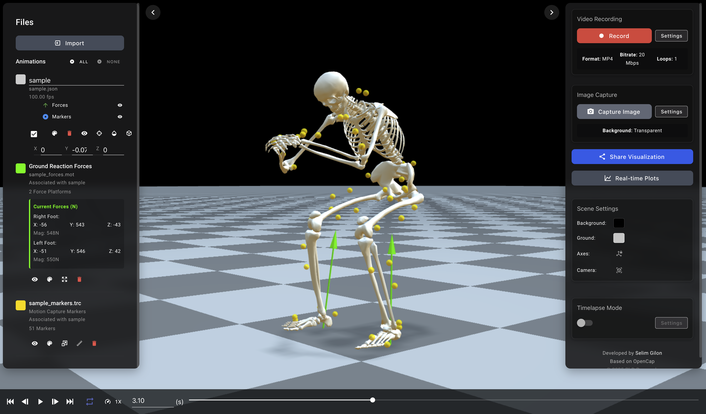
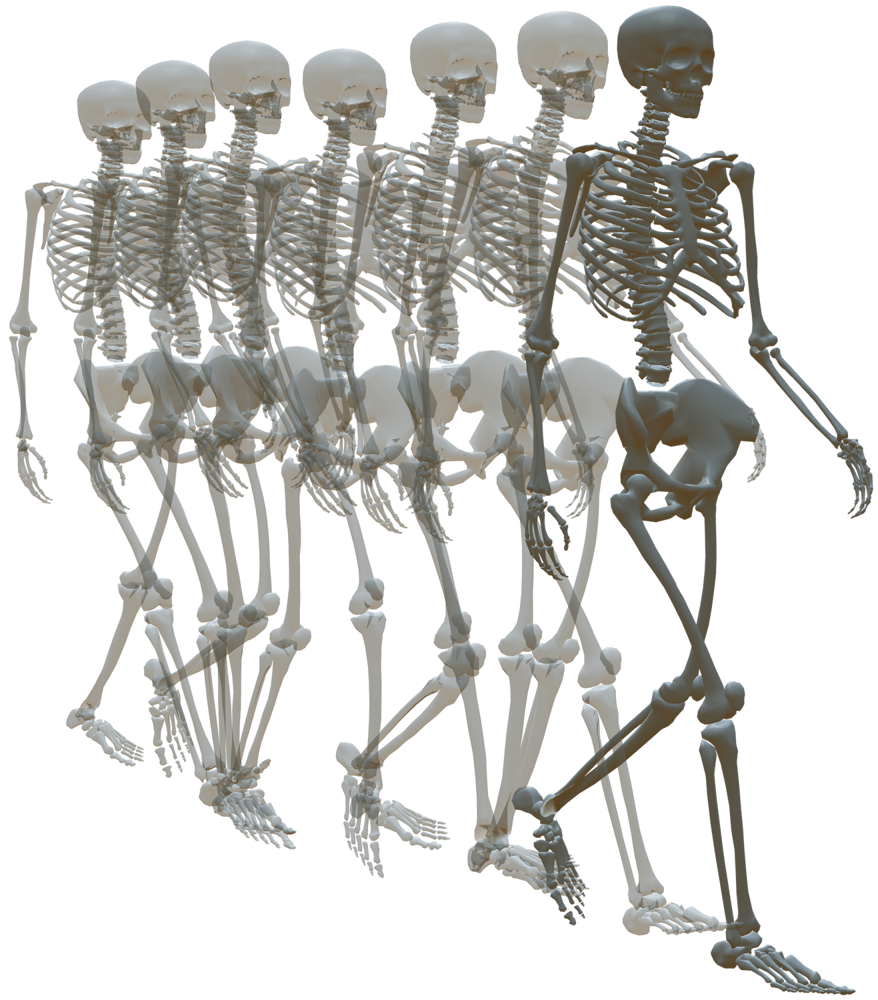

# Summary

OpenCap Visualizer is a comprehensive web-based platform for interactive visualization and automated video creation of biomechanics data. The software provides both a browser-based interface for real-time 3D visualization of human movement and a Python API for programmatic video generation from motion capture data. Built with Vue.js and Three.js, the visualizer supports multiple data formats including OpenSim models (.osim files), kinematics data (.mot, .json), markers (.trc), and force data (.mot) enabling researchers to analyze and share biomechanics simulations with unprecedented ease.

The platform is freely available at: https://opencap-visualizer.onrender.com/

The platform addresses the critical need for accessible visualization tools in biomechanics research, where complex 3D motion data traditionally requires specialized software for analysis and presentation. OpenCap Visualizer democratizes access to biomechanics visualization by offering a browser-based solution requiring no local installation, alongside a Python package for reproducible, automated video rendering.

# Statement of need

Biomechanics research generates complex 3D motion data that is challenging to visualize, analyze, and communicate effectively. Traditional visualization tools often require expensive commercial software, complex installation procedures, or specialized technical expertise, creating barriers for researchers, clinicians, and educators. Furthermore, generating videos for presentations, publications, or educational materials typically involves manual screen recording or complex rendering pipelines that are time-consuming and difficult to reproduce.

OpenCap Visualizer fills this gap by providing a modern, web-based solution that combines interactive visualization with automated video generation capabilities. The software enables researchers to:

1. **Visualize complex biomechanics data** through any modern web browser without software installation
2. **Generate publication-quality videos** programmatically using Python for reproducible research workflows  
3. **Share visualizations** easily through URL-based sharing with advanced compression algorithms
4. **Compare multiple subjects** simultaneously with customizable colors, transparency, and camera controls
5. **Integrate with existing pipelines** through comprehensive Python API and command-line interface

The platform is built on top of the OpenCap software ecosystem [@opencap], providing native support for OpenCap's markerless motion capture data formats while maintaining full compatibility with traditional marker-based systems and OpenSim models [@opensim]. This dual compatibility makes it valuable for the broader biomechanics community, bridging the gap between traditional motion capture workflows and emerging markerless technologies, and ensuring seamless integration with both OpenCap and OpenSim research pipelines.

# Key Features

## Interactive Web-Based Visualization

The core visualization engine is built on Three.js, providing hardware-accelerated 3D rendering directly in web browsers. The web interface is accessible at https://opencap-visualizer.onrender.com/ and requires no installation or registration. Key features include:

- **Real-time 3D rendering** of skeletal models with anatomically accurate geometry
- **Multi-subject comparison** with independent color coding and transparency controls (see \autoref{fig:multisubject})
- **Marker visualization** supporting standard motion capture marker sets (.trc file) (see \autoref{fig:markersforces})
- **Ground reaction forces visualization** using .mot file (see \autoref{fig:markersforces})
- **Video synchronisation** with skeleton to enable simultaneous viewing of original footage and motion data 
- **Timeline controls** with adjustable playback speed and frame-by-frame navigation
- **Recording capabilities** for capturing custom video segments directly from the web interface
- **Image capture** for generating high-resolution screenshots at specific time points
- **Timelapse mode** for creating accelerated visualizations of long-duration movements (see \autoref{fig:timelapse})
- **Color controls** for customizing background, ground plane, skeletal models, and markers

## Live Streaming of Kinematics

Beyond playing back precomputed motion files, OpenCap Visualizer supports low-latency live streaming of kinematics from external analysis pipelines. A lightweight Python WebSocket server streams OpenSim-based kinematics or precomputed JSON trajectories frame-by-frame to the browser using the same body-wise transform format as offline visualizations. The viewer exposes a "live mode" that:

- **Subscribes to a local WebSocket endpoint** (e.g., `ws://localhost:8765`) and incrementally updates body transforms as new frames arrive.
- **Downsamples high-frequency data** (e.g., 100 Hz motion capture) to ~30 Hz for smooth browser rendering while preserving the recorded timing.
- **Handles multiple concurrent subjects**, allowing two kinematic streams (e.g., experimental vs. reference) to be visualized in real time with distinct default colors and offsets.
- **Supports normal playback controls** (play/pause, looping) while buffering incoming frames so that users can pause, inspect a pose, and resume from the most recent streamed frame.

This live streaming capability enables workflows such as monitoring ongoing inverse kinematics computations, validating OpenSim models during data collection, or comparing real-time markerless kinematics against a traditional marker-based reference.

## Python API for Automated Video Creation

The `opencap-visualizer` Python package provides programmatic access to video generation functionality:

The package can be installed via pip:
```
pip install opencap-visualizer
```


```python
import opencap_visualizer as ocv

# Generate video from single subject
success = ocv.create_video(
    "subject_data.json", 
    "output_video.mp4",
    camera="anterior",
    loops=2
)

# Compare multiple subjects
success = ocv.create_video(
    ["subject1.json", "subject2.json"],
    "output_video.mp4",
    colors=["red", "blue"],
    camera="sagittal"
)


# Osim files 
success = ocv.create_video(
    ["model.osim", "motion.mot", "markers.trc", "forces.mot"],
    "output_video.mp4",
)
```

The API supports extensive customization options including viewport dimensions, camera angles, subject colors, transparency levels, and animation loops, enabling integration into automated analysis pipelines.

## Format Compatibility

The software supports multiple data formats common in biomechanics research:

- **OpenSim models** (.osim) with motion files (.mot)
- **JSON-based motion data** from OpenCap and other sources
- **TRC marker files** for traditional motion capture data
- **GRF files** (.mot) for ground reaction forces 


# Implementation

OpenCap Visualizer is implemented as a modern web application with a complementary Python package:

## Frontend Architecture

- **Vue.js** for reactive user interface components
- **Three.js** for 3D graphics rendering and animation
- **Vuetify** for Material Design components

## Backend Services

- **Node.js sharing backend** for URL-based data sharing
- **Python CLI and API** using Playwright for automated browser control
- **Headless video generation** with configurable quality and format options
- **OpenSim file converter backend** to convert .osim and .mot into .json
- **Python WebSocket streamer** for real-time delivery of kinematics to the browser in live mode, using a simple JSON protocol compatible with the offline visualizer format.

# Applications

OpenCap Visualizer has been designed to support diverse biomechanics research applications:

- **Clinical Gait Analysis**: The platform enables clinicians to visualize patient gait patterns, compare pre/post-intervention results, and generate videos for patient education and clinical documentation.
- **Sports Biomechanics**: Researchers can analyze athletic movements, compare techniques across athletes, and create educational content for coaching and training programs.
- **Rehabilitation Research**: The software supports visualization of rehabilitation exercises and recovery progress, enabling researchers to track changes in movement patterns over time. The timelapse functionality is particularly valuable for condensing long rehabilitation sessions into concise visual summaries.
- **Educational Applications**: Educators can create interactive demonstrations of human movement principles, making complex biomechanics concepts accessible to students without specialized software requirements.


# Figures

\autoref{fig:multisubject} shows a multi-subject comparison on the interface, demonstrating the comparison between OpenCap monocular motion capture and traditional marker-based motion capture data in this example.
\autoref{fig:markersforces} demonstrates the comprehensive visualization capabilities including traditional motion capture markers and ground reaction forces. 
\autoref{fig:timelapse} showcases the timelapse functionality, which enables researchers to create accelerated visualizations of movement patterns using skeleton trajectory traces.






# Comparison with Related Work

OpenCap Visualizer distinguishes itself from existing biomechanics visualization tools through its unique combination of web-based accessibility and programmatic video generation:

- **OpenSim GUI** [@opensim] provides comprehensive modeling capabilities but requires local installation and some user expertise. 
- **Biomechanical ToolKit** [@btk] offers Python-based analysis but focuses on data processing rather than visualization and is primarily a solution for code-friendly users.
- **Visual3D** provides commercial visualization but lacks web-based accessibility and open-source flexibility.
- **MuJoCo** [@mujoco] offers a visualizer but requires coding capabilities. 

OpenCap Visualizer's browser-based approach eliminates installation barriers while its Python API enables seamless integration into research workflows, making it uniquely positioned to serve both interactive exploration and automated analysis needs.

# Acknowledgements

We acknowledge the contributions of the OpenCap development team and the broader biomechanics research community for their feedback and testing of the platform. This work builds upon the foundation of open-source biomechanics tools including OpenSim and the Three.js graphics library.

# References 
